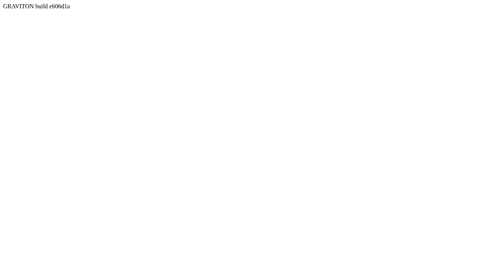

# GRV-0002 evidence — release checks

2026-09-03, commit `e606d1a` (merge of GRV-0001 into `main`).

| Check | Result |
|---|---|
| GitHub Actions `ci` run 33796970906 | success (first run; `pnpm/setup@v2` + Node 24) |
| GitHub Actions `pages` run 33796970966 | success |
| `curl https://helico-tech.github.io/graviton/` | HTTP 200; `src="./assets/index-FGOsWVPQ.js"` |
| Page text (`#app`) via `playwright-cli eval` | `GRAVITON build e606d1a` = `git rev-parse --short HEAD` |
| `playwright-cli console` | `Total messages: 0 (Errors: 0, Warnings: 0)` |
| `window.__gravitonErrors` | `[]` |

Repo: https://github.com/helico-tech/graviton. Local bare remote:
`/data/repos/graviton.git` (same `origin`, two push URLs).
