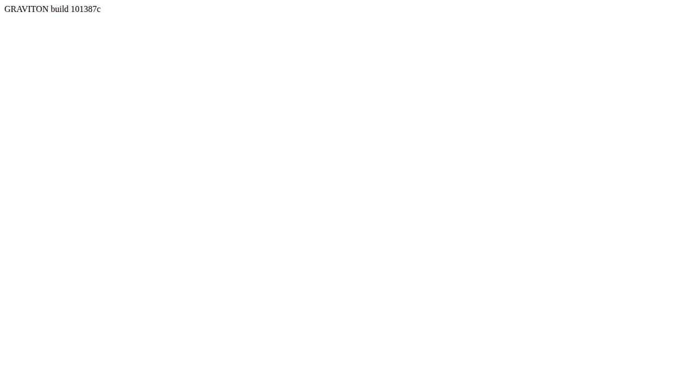

# GRV-0012 evidence — console gate and the screenshot script

2026-09-17, branch `GRV-0012-console-gate-and-screenshot-script`. Node v24.14.0, pnpm 11.25.0.

## What was built

1. **`scripts/lib/console-gate.ts`** — the one console gate every driven page uses (ADR-0004
   §4), re-exported by **`tests/e2e/console-gate.ts`** so `tests/e2e` and `scripts` share the
   implementation without a dependency cycle. `attachConsoleGate(page, options?)` returns
   `{ violations(), assertClean() }` and fails on console `error`/`warning`, `pageerror`,
   `requestfailed`, an HTTP response ≥ 400, and any `dialog` (dismissed, then recorded). The
   `ALLOWLIST` export starts empty — every entry needs a `why: string`, so an entry can't be
   added without saying why the message is benign. `failOnAnyConsoleMessage: true` keeps
   `parity.spec.ts`'s original stricter behaviour (fails on *every* console message, not just
   errors/warnings) available without regressing that spec.
2. **`tests/e2e/console-gate.spec.ts`** — 10 tests against fixture pages served through
   `page.route` for a fake origin (`https://gate-fixture.test`): one per rule (console.error,
   console.warn, a thrown error, a failed request, a 404 subresource, a dialog), a clean page,
   an allowlisted pattern (passed as a parameter so the shared `ALLOWLIST` is never mutated), and
   `failOnAnyConsoleMessage` catching a `console.info` that the default gate ignores. Fixture
   pages need a real `<!DOCTYPE html>` — without one Firefox logs its own "Quirks Mode" /
   "layout forced before load" warnings that would otherwise show up as unrelated violations
   (found by running the tests against real Firefox, not assumed).
3. **`tests/e2e/parity.spec.ts`** refactored to use `attachConsoleGate(page, {
   failOnAnyConsoleMessage: true })` in place of its inline `attachGate` helper; behaviour
   unchanged.
4. **`scripts/lib/static-server.ts`** — the ephemeral static server `scripts/screenshot.ts` uses
   to serve `dist/` (Playwright refuses `file:`). `resolveStaticPath(root, requestPath)` is the
   pure path-resolution core, tested directly for traversal (`..`, an encoded `..`, a `//`-prefixed
   absolute path) without needing a browser or a live server.
5. **`scripts/screenshot.ts`** (`pnpm screenshot`) — launches Chromium, serves `dist/` itself
   when `--url` is absent (refusing with a clear message if `dist/index.html` is missing),
   attaches the shared gate, navigates (appending `debug=1` and waiting for
   `window.graviton.ready` when `--debug` is passed), waits for `document.fonts.ready`, reads the
   build SHA (`window.graviton.version.build` in debug mode, otherwise `build <sha>` parsed out
   of the `#app` placeholder text), writes the PNG, prints one JSON line
   `{ url, build, expected, violations, out }`, and exits non-zero unless the gate is clean and
   the build matches `--expect-build` (compared on the shorter SHA's length, so a 7-char and a
   40-char SHA of the same commit match). Browser and server are always closed in `finally`.
6. **Unit tests** (`scripts/screenshot.test.ts`, `scripts/lib/static-server.test.ts`) cover every
   pure part: flag parsing/validation (`--out` required, `--w`/`--h` positive-integer checks),
   SHA-prefix comparison, the `#app`-text build parser, and the static server's path handling —
   including one test that serves a real file over real HTTP and 404s a missing one.
7. **`tests/e2e/screenshot.spec.ts`** runs the script as a real child process against the dist/
   that `pnpm e2e` already built: succeeds and writes a valid PNG (checked by signature bytes and
   size) when `--expect-build` matches `HEAD`, exits non-zero when it doesn't. Skipped on the
   `firefox` project (`test.skip`) since the test never opens a `page` of its own and only needs
   to run once.
8. **`package.json`**: `"screenshot": "node scripts/screenshot.ts"`.
9. **`docs/README.md`**: a "Proving a change" section cross-referencing ADR-0004 instead of
   repeating it.

## Test-first

`tests/e2e/console-gate.spec.ts` was written and run against a nonexistent `./console-gate.ts`
first (`Cannot find module`, no tests found). `scripts/lib/static-server.test.ts` and
`scripts/screenshot.test.ts` were each run against their not-yet-created modules next, same
failure mode. Only then were `scripts/lib/console-gate.ts`, `tests/e2e/console-gate.ts`,
`scripts/lib/static-server.ts` and `scripts/screenshot.ts` written; both suites went green
without changing any spec. Two real fixture bugs were caught this way, not guessed: a failed
resource and a 404 both trip *two* violations (Chromium's own `console.error` for the failed
load, plus the gate's own `requestfailed`/`http 4xx` signal) — the initial exact-array
assertions were wrong, not the gate, so the assertions were loosened to `toContainEqual` rather
than weakening what the gate catches; and fixture HTML without a doctype trips Firefox-only
Quirks Mode warnings, fixed by giving every fixture a real `<!DOCTYPE html>`.

## `pnpm check` tail

```
$ pnpm typecheck && pnpm lint && pnpm format:check && pnpm test
$ tsc -p tsconfig.json --noEmit && tsc -p tsconfig.sim.json --noEmit
$ eslint . --max-warnings 0
$ prettier --check .
Checking formatting...
All matched files use Prettier code style!
$ vitest run

 RUN  v4.1.11 /data/workspaces/graviton/.worktrees/GRV-0012


 Test Files  22 passed (22)
      Tests  202 passed (202)
   Start at  22:11:08
   Duration  3.07s (transform 900ms, setup 0ms, import 1.90s, tests 3.87s, environment 2ms)
```

`pnpm docs:validate`: `docs: ok`. `pnpm build`: `dist/index.html` 0.74 kB, `dist/assets/index-*.js`
18.92 kB, built in ~37ms. `pnpm headless tests/golden/flyby-burn.json`: `tick 6000`, `hash
e18434ee2785b566`, `MATCH`, ~236 600 ticks/s — unchanged, this unit touches no simulation code.

## `pnpm e2e` tail

```
$ pnpm build && playwright test
$ vite build
✓ 18 modules transformed.
dist/index.html                 0.74 kB │ gzip: 0.41 kB
dist/assets/index-oYaes2LE.js  18.92 kB │ gzip: 7.49 kB │ map: 100.30 kB
✓ built in 37ms
[WebServer] $ vite preview --strictPort --port 4310 --host 127.0.0.1

Running 30 tests using 4 workers
  ...
  ✓  14 [chromium] › tests/e2e/screenshot.spec.ts:37:1 › succeeds and writes a PNG when the build matches (715ms)
  ✓  15 [chromium] › tests/e2e/screenshot.spec.ts:51:1 › exits non-zero when --expect-build does not match (693ms)
  ...
  -  28 [firefox] › tests/e2e/screenshot.spec.ts:37:1 › succeeds and writes a PNG when the build matches
  -  30 [firefox] › tests/e2e/screenshot.spec.ts:51:1 › exits non-zero when --expect-build does not match

  2 skipped
  28 passed (6.0s)
```

## Live-site proof

The deployed site is `https://helico-tech.github.io/graviton/`, currently `main`'s HEAD
(`101387c`, this branch's parent — the merge this unit's team lead will do afterwards is what
moves the live site to this unit's own commit, per the unit's instructions).

**Right SHA** — `pnpm screenshot --url https://helico-tech.github.io/graviton/ --expect-build
101387c --out docs/evidence/GRV-0012/live.png`:

```
{"url":"https://helico-tech.github.io/graviton/","build":"101387c","expected":"101387c","violations":[],"out":"docs/evidence/GRV-0012/live.png"}
```

Exit code `0`.

**Wrong SHA** — `pnpm screenshot --url https://helico-tech.github.io/graviton/ --expect-build
0000000 --out runs/live-wrong-sha.png` (not committed — scratch output only):

```
{"url":"https://helico-tech.github.io/graviton/","build":"101387c","expected":"0000000","violations":[],"out":"runs/live-wrong-sha.png"}
```

Exit code `1`.



`live.png` is a plain white 1280×720 page with `GRAVITON build 101387c` in the top-left corner
(GRV-0001's placeholder text, unchanged by this unit) — the real deployed page, proven to be the
commit at `origin/main`'s HEAD at the time of this run. No console violations either run.

## No unrelated findings

Nothing outside this unit's scope was found; no issue filed.
